### Hello, I'm Almir! 👋
I studies Software Engineering, Full Stack Development & SFPC Scrum Foundation.

 

## 📌 Pinned Repositories

<a href="https://github.com/Almir-git-unifc/full-stack_crud_mongodb">
  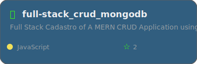
</a>

 

<a href="https://github.com/Almir-git-unifc/single-page-app_portfolio">
  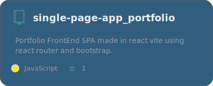
</a>
<a href="https://github.com/Almir-git-unifc/ToDo-List_react">
  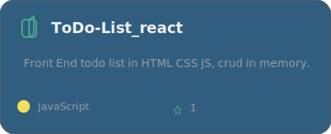
</a>

  <a href="https://github.com/Almir-git-unifc/full-stack_crud_mongodb">
    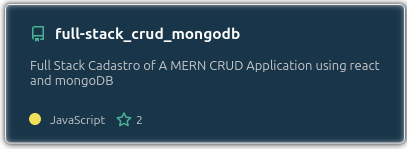
  </a>
  

  <a href="https://github.com/Almir-git-unifc/single-page-app_portfolio">
    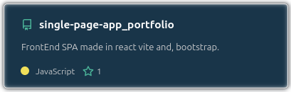
  </a>
  <a href="https://github.com/Almir-git-unifc/ToDo-List_react">
    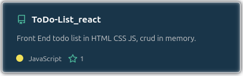
  </a>

 
 

## &#x1f4c8; GitHub Stats

  

<!-- O quadro Stats foi configurado para altura 33, ou seja, &line_height=33 ; e o quadro language foi configurado para 4 linguagens &langs_count=4 -->
<!-- Se aparecer outras lingaugens estes quadros precisam ser reconfigurados -->

<!-- GitHub Stats voltou a aparecer em 22/01/2026; então vamos deixar a imagem de stats comentada momentaneamente

  <a href="https://github.com/Almir-git-unifc/Almir-git-unifc">
    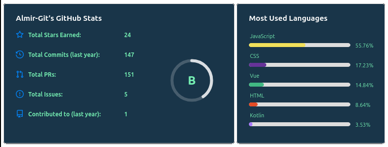
  </a>

-->

<!--   -->

 
 

🏆 GitHub Trophies
---

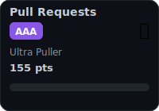
  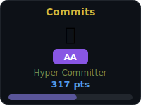
  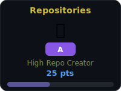
  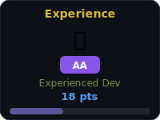
  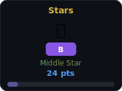

 

## 💼 Skills

More Skills

 

 

# General contributions; made with Platane/snk

<picture>
  <source
    media="(prefers-color-scheme: dark)"
    srcset="https://raw.githubusercontent.com/platane/snk/output/github-contribution-grid-snake-dark.svg"
  />
  <source
    media="(prefers-color-scheme: light)"
    srcset="https://raw.githubusercontent.com/platane/snk/output/github-contribution-grid-snake.svg"
  />
  
</picture>

 
 
 
 

> ### Want to know how I made this README?
>
> I use this <a href="https://www.dio.me/articles/como-criar-um-bom-readmemd" target="_blank">tutorial</a>; for [badges1](https://ileriayo.github.io/markdown-badges/) and [badges2](https://github.com/inttter/md-badges); > & this repository to [snake](https://github.com/Platane/Platane/blob/master/README.md). Unfortunately, the trophies at ryo-ma/github-profile-trophy and the API for anuraghazra statistics are often offline.

